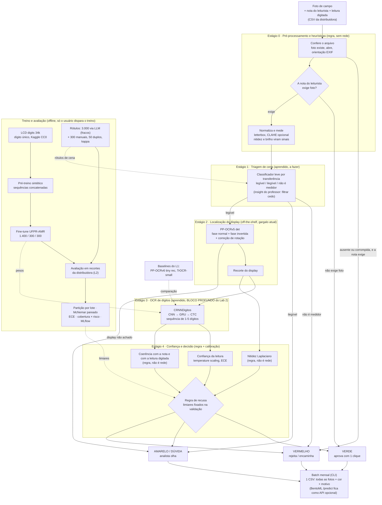
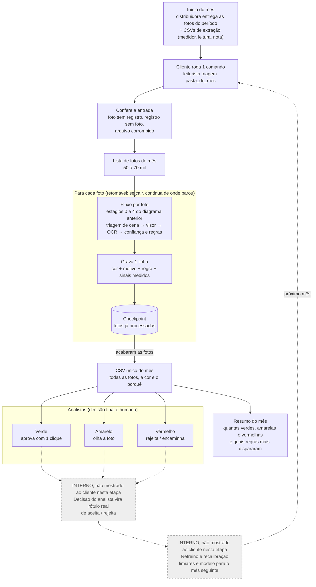

# Arquitetura macro do LEITURISTA (visão única)

**Data:** 2026-09-30 · **Status:** desenho alvo — junta (a) o pipeline que já roda
(`src/leiturista/inference.py`, `service.py`), (b) as instruções do professor de DL
(`docs/dl-lab2/`: guia + enunciado Lab 2) e (c) o plano de treino do `CRNNDigitos`
(`docs/dl-lab2/plano-treino-crnn.md`). Decisão: o OCR de dígitos passa a ser o **CRNN + CTC do
esqueleto do professor**, treinado por nós; PP-OCR e TrOCR viram baselines (item L1).

## Diagrama

## Fluxo mensal (batch)

Envelopa o fluxo por foto do diagrama acima: o nó "Fluxo por foto" é exatamente os estágios 1-4.

O laço de retroaprendizado (tracejado) **será feito, mas não é mostrado ao cliente nesta etapa**:
fica só no diagrama técnico interno. Ele é a "Abordagem C" de
`docs/triagem-vermelho-amarelo-verde.md` e depende de o cliente devolver as decisões dos
analistas, o que ainda não foi combinado. Os diagramas para leigos não o trazem.

## Entrega ao cliente: CSV mensal em batch

O cliente roda isso **uma vez por mês** sobre todas as fotos do período e recebe **uma tabela
CSV única**, uma linha por foto, com a classificação e o porquê. Consequências de arquitetura:

1. **Batch é o modo principal**, não a API: um comando (`leiturista triagem <pasta_do_mes>`) que
   varre a pasta, é retomável (checkpoint por foto, não recomeça do zero) e escreve o CSV no fim.
   O `/predict` do BentoML fica como endpoint opcional sobre o mesmo núcleo.
2. **Cada estágio grava a sua saída na linha**, então "por quê" é rastreável e não um texto solto.
   Colunas previstas: `foto`, `lote`, `medidor`, `nota`, `triagem` (verde/amarelo/vermelho),
   `motivo` (frase curta, ex.: "nota exige foto e display não foi localizado"), `regra`
   (código da regra que decidiu), `cena` + `p_cena`, `display_achado`, `leitura_modelo` +
   `confianca`, `leitura_digitada`, `bate_com_digitada`, `nitidez`, `latencia_s`, `versao_modelo`.
3. **Motivo vem das regras e dos sinais, não de texto gerado**: cada cor sai de uma regra nomeada
   que lê colunas já no CSV, então o motivo é determinístico e auditável (e serve ao analista
   no amarelo).
4. **Volume de 50-70 mil fotos/mês**: a latência medida (média 4,43 s em CPU, p90 13,2 s)
   significaria ~3-4 dias corridos de CPU; o orçamento de tempo do batch precisa ser medido por
   estágio (L4) e a triagem de cena (estágio 1) barra fotos cedo para economizar esse custo.
5. **Sem foto no CSV**: só nomes de arquivo e sinais, por LGPD.

## O que cada estágio é, e de onde vem

| # | Estágio | Natureza | Estado hoje | Origem da instrução |
|---|---|---|---|---|
| 0 | Pré-processamento e heurísticas | Regra clássica (OpenCV), sem rede | Parcial: nitidez (Laplaciano) e rotação existem em `inference.py`; testes de CLAHE/letterbox em `notebooks/02_tratamento.ipynb`; regra "nota não exige foto → verde" só desenhada | `docs/triagem-vermelho-amarelo-verde.md` (29 notas não exigem foto, 32 exigem); Nitidez isolada **não** prediz acerto do OCR (r=-0,002), então é sinal, não decisor |
| 1 | Triagem de cena (3 classes) | Rede (transferência, cabeça 3 classes) | **Não existe.** Hoje "sem medidor" e "ilegível" caem juntos em `sem_leitura_detectada` | Insight do professor (README §2d) + bloco VoltLens do enunciado; rótulos: 3.000 fracos via LLM (`docs/labels_distribiodora.jsonl`) + 300 manuais (item C) |
| 2 | Localização do display | Modelo pronto (PP-OCRv5 det) + heurística de rotação/inversão | Roda. Só ~15% das fotos de campo dão recorte localizável; 41,7% dos recortes vêm da fase invertida | `docs/fotos_distribuidora_dados.md`; L4 pede medir a latência por estágio (onde estão os 13,2 s do p90) |
| 3 | OCR de dígitos | **Rede nossa**: CRNN+CTC | Treinado do zero no UFPR-AMR: **0,880 exato / 0,948 por dígito** (vs. 0,357/0,846 do off-the-shelf). Pré-treino sintético **planejado, não implementado** | Esqueleto do professor (B, L1-L4); plano em `plano-treino-crnn.md` |
| 4 | Confiança e decisão | Calibração (aprendida, 1 parâmetro) + regras | Nitidez e flags existem; calibração, recusa formal e coerência com nota **não** | Guia §9 (calibrar, recusar, cobertura×risco); item E |

Regra do professor aplicada: **o que é regra não é rede** (comparar leitura com nota e valor
digitado, limiar de nitidez). Só estágios 1 e 3 são aprendidos (0, 2 parcial e 4 são regra).

## Conta do produto das taxas (exigência da ficha, seção 3)

Taxa ponta a ponta = produto das taxas por estágio. Só o estágio 3 tem número medido
(0,880 exato no UFPR-AMR, **domínio público, não o do cliente**). Estágios 1, 2 e 4 ainda sem
medida: não estimar sem fonte. A planilha de erro do Marco 2 leva uma coluna por estágio
(guia §3) — medir estágio 2 é a prioridade, porque é o gargalo.

## Decisões que esta arquitetura já carrega

1. **Estágios, não ponta a ponta**: não há rótulo de decisão final (aceita/rejeita) da
   distribuidora (guia §3; `triagem-vermelho-amarelo-verde.md`). Abordagem A (regras) primeiro,
   supervisionado depois.
2. **CRNN nosso no estágio 3, PP-OCR/TrOCR só como baseline** (L1 pede desmontar e comparar as
   duas famílias com 10 erros reais cada).
3. **Sem congelamento no fine-tune** do CRNN; pré-treino sintético por composição de dígitos,
   augmentation de glare/cutout **antes** de concatenar (plano de treino).
4. **Partição por lote**, nunca por foto; fotos do cliente fora do repositório e fora dos
   outputs dos notebooks.
5. **Decisão final humana**: amarelo é o default, verde/vermelho só com confiança calibrada.

## Em aberto

1. Quantas classes de cena (3 do VoltLens ou binário "tem medidor?")? Decidir ao rotular C2.
2. Os 3.000 rótulos LLM são **fracos**: servem para pré-rotular, mas a avaliação usa os 300
   manuais com kappa.
3. Estágio 3 do plano de treino (recortes da distribuidora) depende de reconstruir
   `data/distribuidora_amr`, que não existe neste Mac.
4. Meta de negócio "cobertura ≥ X com risco ≤ Y" a fixar para a curva do item E2.
